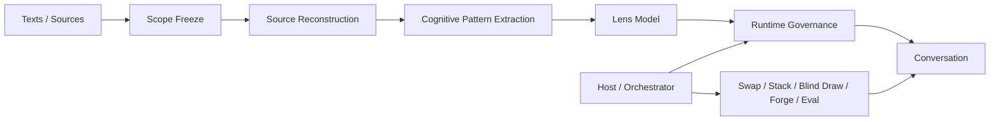
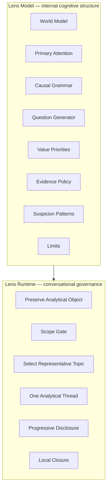

# Cognitive Lenses

**Build lenses, not personas.**

*Distill a way of seeing from text, then bring it back into conversation.*

Cognitive Lenses is an open workflow for distilling a limited source set into a reusable AI perspective.

The goal is **not** to imitate how a thinker sounds.

The goal is to reconstruct a source-scoped way of seeing:

- what the lens notices first;
- how it frames a problem;
- what causal mechanisms it considers important;
- what questions it tends to ask;
- what evidence it treats as relevant;
- what explanations it refuses to accept too quickly.

A Lens is best understood as a **stable attention pattern** layered onto an AI conversation.

> Give it sources. Distill a way of seeing.

[中文说明](README.zh-CN.md)

---

## Why this project exists

The original idea was simple:

> **I wanted to talk with a way of thinking, not only with a fixed persona.**

Most AI character or persona systems ask:

> “What would this person sound like?”

Cognitive Lenses starts from a different question:

> **“What would become visible if I looked at this problem through the patterns of attention found in these texts?”**

The goal is not to reconstruct a complete person.

It is to use a limited, explicit source set to recover a **source-scoped cognitive perspective**:

- what the material repeatedly treats as important;
- what kinds of distinctions it makes;
- how it explains causes;
- what questions it tends to generate;
- what it treats as evidence;
- what kinds of explanations it distrusts.

The inspiration comes from wanting a more direct relationship with ideas themselves.

A book, a thinker, a school, or a theoretical tradition can leave behind more than propositions to memorize. Across enough text, it may also leave traces of a recurring **way of seeing**.

Cognitive Lenses tries to distill those traces into something conversational.

Not:

> “Pretend to be the thinker.”

But:

> **“Let this body of text temporarily change what the model notices.”**

The result is not a recovered mind, and it does not claim doctrinal completeness.

It is a new conversational object:

> **a source-scoped lens distilled from text.**

That means the same question can be revisited through different lenses without changing the underlying object.

The stage stays still.

The lens changes.

And what counts as important may change with it.

---

## From text to a conversational lens



The pipeline can be read as:

> **Text → recurring cognitive patterns → Lens → conversation**

The key separation is between **what the Lens knows internally** and **what the conversation needs right now**.



> **The internal model may be rich. The visible conversation should remain selective.**

## What can become a Lens?

The workflow is designed to support:

- mature theories;
- established schools of thought;
- well-documented real thinkers;
- a single theoretical book;
- a methodology or analytical tradition;
- long-form source sets;
- sufficiently documented fictional characters or fictional traditions.

### Recommended starting points

**Most stable**
- mature theories and schools;
- real thinkers with substantial primary material;
- tightly scoped theoretical books.

**More experimental**
- living creators or professionals with uneven source coverage;
- fictional characters;
- short source sets.

Fictional-character lenses usually require **substantial text**. With only a few quotes or scenes, the result tends to collapse into personality tags or voice imitation rather than a genuine cognitive lens.

---

## Core pipeline

### 1. Scope Freeze
Define exactly what the lens claims to represent.

A lens built from one book should not silently claim to represent an entire thinker or school.

### 2. Source Reconstruction
Recover what the sources actually support before inventing runtime behavior.

### 3. Cognitive Pattern Extraction
Extract recurring patterns such as:

- ontology / world model;
- attention;
- causal grammar;
- question generation;
- value priorities;
- evidence preferences;
- suspicion patterns;
- applicability;
- theoretical limits.

### 4. Lens Model
Store the distilled cognitive structure as the internal model.

### 5. Runtime Governance
Convert the model into a conversational lens.

Runtime should preserve the user's object, control scope, select one representative issue, stay on one thread, and disclose depth progressively.

### 6. Lens Package
Package the result into a reusable Skill or another compatible instruction format.

---

## Runtime principle

A successful Lens should feel like:

> “The model keeps noticing questions I would not have asked by default.”

It should **not** feel like:

> “The model is reciting a theory handbook.”

The most important runtime rules are:

- preserve the user's analytical object;
- broad object ≠ exhaustive answer;
- internal relevance ≠ current conversational relevance;
- one representative issue first;
- one analytical thread at a time;
- progressive disclosure;
- no raw runtime-log leakage;
- no self-congratulation;
- no unsolicited cross-lens routing.

---

## Host vs Lens

The Lens itself should remain narrow.

The **Host / Orchestrator** may provide:

- lens selection;
- lens switching;
- lens stacking;
- multi-lens comparison;
- demo mode;
- evaluation mode;
- random lens draws;
- source loading;
- routing.

The **Lens** should mainly provide:

> a stable way of looking at the current object.

This separation keeps individual lenses composable.

---

## Play modes

The repository does not prescribe one interface.

Possible interaction modes include:

- **Single Lens** — stay with one perspective;
- **Lens Swap** — keep the object fixed, change the perspective;
- **Blind Draw** — draw a lens before revealing its name;
- **Lens Stack** — combine two compatible lenses deliberately;
- **Contrast Mode** — compare how two lenses frame the same object;
- **Lens Forge** — distill a new lens from a source set;
- **Book Lens** — scope a lens to one book only;
- **Thinker Lens** — scope a lens to a documented thinker;
- **School Lens** — distill a shared core while preserving internal disputes;
- **Personal Lens** — experimental distillation of a recurring reasoning style from sufficient material.

These are **host-level play patterns**. They should not be hard-coded into every Lens.

---

## Forking

Forks are encouraged.

Useful fork directions include:

- changing the source scope;
- creating a narrower book-specific lens;
- creating a later-period / earlier-period thinker lens;
- changing runtime pacing;
- experimenting with another AI platform;
- adding an evaluator;
- building a visual lens library;
- creating a lens-routing host;
- translating the mother template;
- testing alternative distillation schemas.

Please preserve source scope clearly when publishing a fork.

A fork should say **what it is based on**, not merely what name it uses.

---

## Repository layout

```text
cognitive-lenses/
├── README.md
├── README.zh-CN.md
├── LICENSE
├── CONTRIBUTING.md
├── template/
│   └── cognitive-lens-template/
│       └── SKILL.md
└── docs/
    ├── ARCHITECTURE.md
    ├── ORIGIN.md
    ├── REFERENCES.md
    ├── FORKING.md
    └── PLAY_MODES.md
```

The first public version intentionally does **not** ship a gallery of example lenses.

The goal is to publish a clean architecture and a forkable mother template first.

---

## References

This project is an experimental engineering workflow, not an established academic standard.

Its design is informed by several adjacent ideas:

- reusable AI Skills / portable instruction workflows;
- problem framing and epistemological framing;
- source-grounded interpretation;
- separation between internal model and conversational runtime;
- versioned, forkable open-source workflows.

See [`docs/REFERENCES.md`](docs/REFERENCES.md).

---

## License

MIT.

Fork it, modify it, build a strange lens laboratory on top of it.
