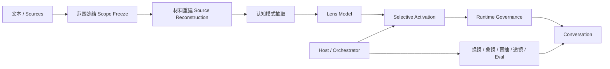
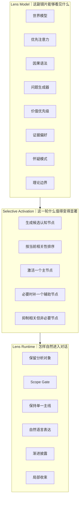

# Cognitive Lenses｜认知镜片

**Build lenses, not personas.**

**充分蒸馏，选择性激活。**

*从文本中蒸馏一种看法，再只把当前真正需要的部分带回对话。*

Cognitive Lenses 是一个开放的认知视角蒸馏流程：从有限材料中提取稳定的问题意识与观察方式，再把它编译成可以在 AI 对话中调用的 Lens。

它不是为了模拟：

> “这个人会怎么说话？”

而是尝试恢复：

- 它首先注意什么；
- 它如何重新定义问题；
- 它倾向使用什么因果解释；
- 它会继续追问什么；
- 什么证据更重要；
- 哪些解释不会被轻易接受。

最终得到的不是一个 AI 人格，而是一副 **source-scoped cognitive lens（范围明确的认知镜片）**。

> 给它材料，蒸馏一种看法。

[English](README.md)

---

## 为什么会有这个项目

这个项目来自一个简单的问题：

> **我想直接和一种思想方式对话，而不仅仅是和一个固定的人格聊天。**

很多 AI Persona 系统关注：

> “这个人会怎样表达？”

Cognitive Lenses 换成：

> **“如果通过这些文本中反复出现的注意力模式来看，同一个问题会出现什么新的结构？”**

它不声称复原一个完整的人。

它试图从有限、明确的文本范围中恢复一种认知视角：

- 反复出现的重要问题；
- 稳定的概念区分；
- 因果解释方式；
- 自然生成的问题；
- 证据偏好；
- 不轻易接受的解释。

一本书、一个思想家、一个学派或理论传统留下的不只是知识点，也可能留下某种反复出现的：

> **看问题的方法。**

因此目标不是：

> “假装你就是这个思想家。”

而是：

> **“让这组文本暂时改变模型首先会看见什么。”**

舞台可以保持不变。

只换镜片。

而什么东西突然变得重要，也会随之改变。

---

## 核心架构



整条流程现在更准确地表示为：

> **文本 → 认知模型 → 选择性激活 → 对话**

真正关键的不只是“Lens 后台知道什么”和“前台怎么说”的区别。

中间还有一层：

> **这一轮到底应该让什么进入前台。**

---

## 三层结构



核心工程原则：

> **后台模型很丰富，不代表前台回答也应该很丰富。**

一副 Lens 可能同时知道十个相关点，但当前这一轮也许只需要一个。

> **Internal relevance ≠ current conversational relevance.**

---

## Selective Activation｜选择性激活

选择性激活用来防止一种典型问题：**Corpus-to-Answer Leakage**。

也就是：

> 材料里有 → 后台知道 → 因为相关 → 全部塞进回答。

真正成熟的 Lens 需要额外判断：

1. 当前有哪些认知节点可能相关；
2. 哪一个对当前问题最有解释力；
3. 是否真的需要再激活一个辅助节点；
4. 哪些东西虽然相关，但现在应该保持静默；
5. 当前这一层什么时候已经讲够，可以停下来等用户继续。

所以母版现在把原则正式写成：

> **充分蒸馏，选择性激活。**

详见 [`docs/SELECTIVE_ACTIVATION.md`](docs/SELECTIVE_ACTIVATION.md)。

---

## 什么可以成为 Lens？

适合：

- 成熟理论；
- 成熟学派；
- 材料丰富的真实人物；
- 单本理论著作；
- 方法论体系；
- 长文本资料集；
- 材料充分的虚构人物。

推荐优先：

1. 成熟理论与学派；
2. 有大量文本支持的真实人物；
3. 范围明确的单本书。

虚构人物需要特别注意：短文本很容易退化成“性格标签 + 口吻模仿”，而不是认知镜片。

---

## 母版流程

### 1. Scope Freeze｜范围冻结
明确这副镜片到底代表什么。

### 2. Source Reconstruction｜材料重建
先恢复文本真正支持的内容，再生成认知结构。

### 3. Cognitive Pattern Extraction｜认知模式抽取
抽取世界模型、注意力、因果语法、问题生成方式、价值优先级、证据偏好、怀疑模式、适用范围和理论边界。

### 4. Lens Model
形成完整的后台认知结构。

### 5. Selective Activation
根据当前问题对后台认知节点重新排序，只激活现在真正有解释力的部分。

### 6. Runtime Governance
把被激活的部分自然地带进对话，同时控制 Scope、单一主线和渐进披露。

### 7. Lens Package
输出为 Skill 或其他可复用格式。

---

## Runtime 原则

成功的 Lens 应该让人产生：

> **“它怎么总会注意到一些我原来没注意的问题？”**

而不是：

> **“我打开了一份理论讲义。”**

因此母版固定：

- 保留用户原始分析对象；
- Broad object ≠ exhaustive answer；
- Internal relevance ≠ current conversational relevance；
- 一次优先一个代表性切口；
- 一次保持一条分析主线；
- 渐进披露；
- 不泄露后台 Harness；
- Lens 不评价自己；
- Lens 不主动替宿主切换其他 Lens。

---

## Host 和 Lens 分工

### Lens 负责

> **用当前视角观察当前对象。**

### Host / Orchestrator 可以负责

- 选镜片；
- 换镜片；
- 多镜片对照；
- Lens Stack；
- 随机抽镜片；
- Demo；
- Eval；
- 材料载入；
- Lens Forge；
- 自动路由。

Host 也可以影响激活策略，但单个 Lens 仍应保持范围明确、干净、可组合。

---

## 趣味玩法

玩法属于 Host 层，包括：

- Single Lens｜单镜
- Lens Swap｜换镜
- Blind Draw｜盲抽
- Lens Stack｜叠镜
- Contrast Mode｜对照
- Lens Forge｜造镜
- Book Lens｜单书镜片
- Thinker Lens｜人物镜片
- School Lens｜学派镜片
- Personal Lens｜个人认知镜片（实验）

---

## Fork

欢迎 Fork。

适合方向包括修改 source scope、制作书籍或时期版本、实验不同 Selective Activation 策略、修改 Runtime、移植其他 AI 平台、增加 Eval、制作镜片管理器或可视化镜廊。

发布 Fork 时，请说明材料范围。

不要只继承一个名字。

---

## 仓库结构

```text
cognitive-lenses/
├── README.md
├── README.zh-CN.md
├── LICENSE
├── CONTRIBUTING.md
├── template/
│   └── cognitive-lens-template/
│       └── SKILL.md
└── docs/
    ├── ARCHITECTURE.md
    ├── SELECTIVE_ACTIVATION.md
    ├── ORIGIN.md
    ├── REFERENCES.md
    ├── FORKING.md
    └── PLAY_MODES.md
```

首版仍然故意不放大量具体 Lens 案例。

先把母版架构、激活机制、流程、参考依据和 Fork 方式做干净。

---

## 第一版原则

Cognitive Lenses 是一个实验性的 AI 工程工作流，不是已经建立的学术标准。

其中 **Lens Model / Selective Activation / Runtime** 三层分离，是从样机迭代中形成的项目级工程约定。
