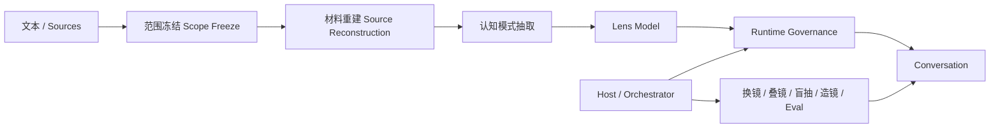
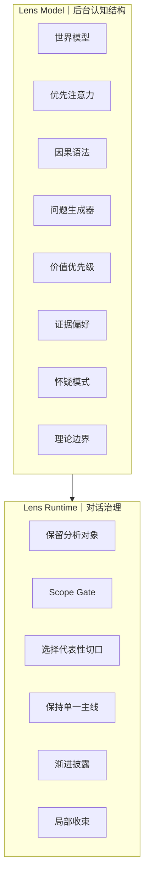

# Cognitive Lenses｜认知镜片

**Build lenses, not personas.**

**不扮演思想家，蒸馏他们观察世界的镜片。**

Cognitive Lenses 是一个开放的认知视角蒸馏流程：从有限材料中提取稳定的问题意识与观察方式，再把它编译成可以在 AI 对话中调用的 Lens。

它不是为了模拟：

> “这个人会怎么说话？”

而是尝试恢复：

- 它首先注意什么；
- 它如何重新定义问题；
- 它倾向使用什么因果解释；
- 它会继续追问什么；
- 什么证据更重要；
- 哪些解释不会被轻易接受。

最终得到的不是一个 AI 人格，而是一副 **source-scoped cognitive lens（范围明确的认知镜片）**。

> 给它材料，蒸馏一种看法。

[English](README.md)

---

## 为什么会有这个项目

这个项目来自一个简单的问题：

> **我想直接和一种思想方式对话，而不仅仅是和一个固定的人格聊天。**

很多 AI Persona 系统关注：

> “这个人会怎样表达？”

Cognitive Lenses 换成：

> **“如果通过这些文本中反复出现的注意力模式来看，同一个问题会出现什么新的结构？”**

它不声称复原一个完整的人。

它试图从有限、明确的文本范围中恢复一种认知视角：

- 反复出现的重要问题；
- 稳定的概念区分；
- 因果解释方式；
- 自然生成的问题；
- 证据偏好；
- 不轻易接受的解释。

一本书、一个思想家、一个学派或理论传统留下的不只是知识点，也可能留下某种反复出现的：

> **看问题的方法。**

因此目标不是：

> “假装你就是这个思想家。”

而是：

> **“让这组文本暂时改变模型首先会看见什么。”**

---

## 核心架构

流程：

> **文本 → 稳定认知模式 → Lens → 对话**

---

## Lens Model 与 Runtime 分离

核心原则：

> **后台可以很重，前台只需要让用户感觉自己真的换了一副镜片。**

---

## 什么可以成为 Lens？

适合：

- 成熟理论；
- 成熟学派；
- 材料丰富的真实人物；
- 单本理论著作；
- 方法论体系；
- 长文本资料集；
- 材料充分的虚构人物。

推荐优先：

1. 成熟理论与学派；
2. 有大量文本支持的真实人物；
3. 范围明确的单本书。

虚构人物需要特别注意：

短文本容易生成：

> 性格标签 + 口吻模仿

而不是认知镜片。

---

## 母版流程

### 1. Scope Freeze｜范围冻结

明确这副镜片代表什么。

一本书不能默认代表一个人的全部思想。

### 2. Source Reconstruction｜材料重建

先恢复文本支持的内容，再生成运行规则。

### 3. Cognitive Pattern Extraction｜认知模式抽取

抽取：

- 世界模型；
- 注意力；
- 因果语法；
- 问题生成方式；
- 价值优先级；
- 证据偏好；
- 怀疑模式；
- 适用范围；
- 理论边界。

### 4. Lens Model

形成内部认知结构。

### 5. Runtime Governance

转换成对话中的镜片。

规则：

- 保留用户原始对象；
- 不因为知道更多就全部输出；
- 先选择代表性切口；
- 一次保持一条分析主线；
- 渐进披露；
- 不泄露后台 Harness。

### 6. Lens Package

输出为 Skill 或其他可复用格式。

---

## 趣味玩法

玩法属于 Host 层，而不是污染 Lens 本身。

包括：

- Single Lens｜单镜
- Lens Swap｜换镜
- Blind Draw｜盲抽
- Lens Stack｜叠镜
- Contrast Mode｜对照
- Lens Forge｜造镜
- Book Lens｜单书镜片
- Thinker Lens｜人物镜片
- School Lens｜学派镜片

---

## Fork

欢迎 Fork。

适合方向：

- 修改 source scope；
- 制作更窄的书籍镜片；
- 制作时期版本；
- 修改 Runtime；
- 移植其他 AI 平台；
- 增加 Eval；
- 制作镜片管理器。

发布 Fork 时，请说明材料范围。

不要只继承一个名字。

---

## 第一版原则

首版故意不放大量案例。

先公开：

- 母版架构；
- 流程；
- 参考依据；
- Fork 方式。

目标是建立一个干净、可组合的认知镜片实验框架。
