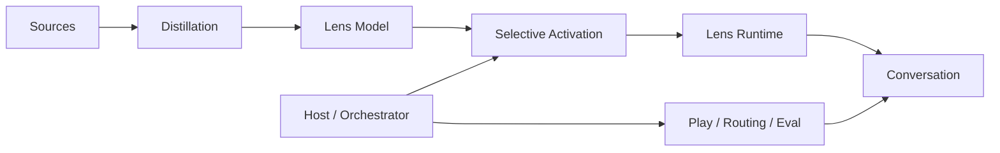
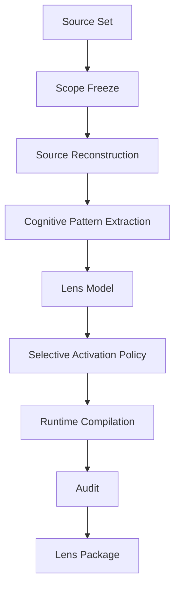
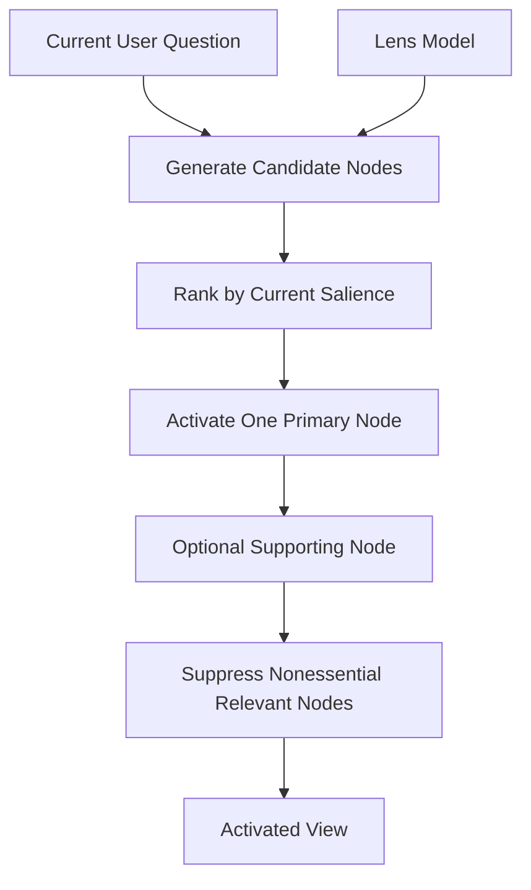

# Architecture

Cognitive Lenses separates **distillation**, **cognitive modeling**, **selective activation**, **conversation runtime**, and **host-level play**.

The central idea is simple:

> **Distill broadly. Activate selectively.**

A rich source set may support a rich internal Lens Model. That does not mean every relevant concept should appear in every answer.

---

## 1. System boundary



### Distillation
Builds a source-scoped cognitive structure from texts or other supplied material.

### Lens Model
Stores what the perspective is capable of noticing, asking, explaining, valuing, and doubting.

### Selective Activation
Determines which part of the Lens Model deserves to become salient **in the current turn**.

### Lens Runtime
Turns the activated material into natural conversation while preserving scope, object identity, and conversational pacing.

### Host / Orchestrator
Controls switching, stacking, comparison, blind draw, Lens Forge, demo, evaluation, source loading, and routing.

---

## 2. Distillation pipeline



The pipeline should not jump directly from source material to persona behavior.

The source is first reconstructed, then abstracted into a cognitive model, then governed by an activation policy.

---

## 3. Lens Model schema

```text
Lens Identity
├── Source Scope
├── World Model
├── Primary Attention
├── Causal Grammar
├── Question Generator
├── Value Priorities
├── Evidence Policy
├── Suspicion Patterns
├── Applicability
└── Theoretical Limits
```

This is the **available cognitive structure**, not the visible answer template.

---

## 4. Selective Activation

Selective Activation sits between the Lens Model and Runtime.



A candidate node may be relevant without deserving visible output.

Activation should prefer:

1. direct relevance to the user's actual question;
2. explanatory power;
3. representativeness of the Lens;
4. support from the available material;
5. compatibility with the current conversational scope.

Default ordinary-use policy:

- activate **one primary node**;
- optionally activate **one supporting node**;
- suppress the rest;
- recalculate on the next turn.

This is not merely brevity control.

It is an explicit relevance policy.

> **Internal relevance ≠ current conversational relevance.**

See [`SELECTIVE_ACTIVATION.md`](SELECTIVE_ACTIVATION.md).

---

## 5. Runtime governance

```text
Activated View
↓
Preserve Analytical Object
↓
Scope Gate
↓
Maintain One Analytical Thread
↓
Translate into Natural Language
↓
Progressive Disclosure
↓
Local Closure
↓
Wait for User
```

Runtime should expose reasoning, not the internal run log.

The user should experience a changed perspective, not a checklist of modules.

---

## 6. Why the activation layer exists

Without an activation layer, source-rich systems tend to develop **corpus-to-answer leakage**:

```text
Source contains X
↓
Lens knows X
↓
X is somehow relevant
↓
X appears in the answer
```

This produces long, encyclopedic, unstable responses.

Cognitive Lenses instead aims for:

```text
Source contains many relevant structures
↓
Lens Model preserves them
↓
Current question establishes salience
↓
Only the strongest explanatory structure activates
↓
Runtime develops that thread
```

The goal is not to know less.

The goal is to **use what is known with restraint**.

---

## 7. Core engineering rules

> **Broad object ≠ exhaustive answer.**

> **Internal relevance ≠ current conversational relevance.**

> **A rich Lens Model does not imply a rich visible answer.**

> **The Host chooses how lenses are played; the Lens chooses how the current perspective sees.**

> **Distill broadly. Activate selectively.**
