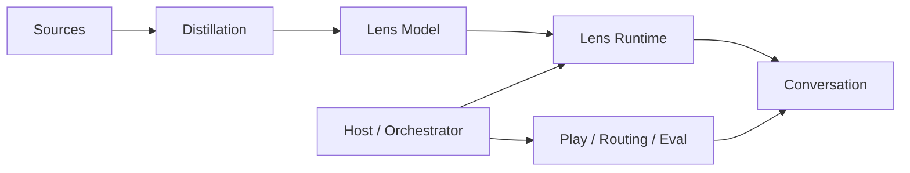
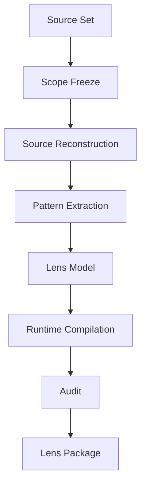

# Architecture

## 1. System boundary

Cognitive Lenses separates four concerns:



### Distillation
Builds the internal cognitive model from a source-scoped corpus.

### Lens Model
Stores the perspective itself.

### Lens Runtime
Controls how much of that perspective should appear in one turn.

### Host / Orchestrator
Controls composition, switching, demos, evaluation, routing, and playful interfaces.

---

## 2. Distillation pipeline



## 3. Lens Model schema

```text
Lens Identity
├── Source Scope
├── World Model
├── Primary Attention
├── Causal Grammar
├── Question Generator
├── Value Priorities
├── Evidence Policy
├── Suspicion Patterns
├── Applicability
└── Theoretical Limits
```

## 4. Runtime governance

```text
Input
↓
Preserve Analytical Object
↓
Scope Gate
↓
Select Representative Topic
↓
Maintain One Analytical Thread
↓
Translate Theory into Natural Language
↓
Local Closure
↓
Wait for User
```

The core engineering rule:

> Internal model complexity must not force visible conversational complexity.
